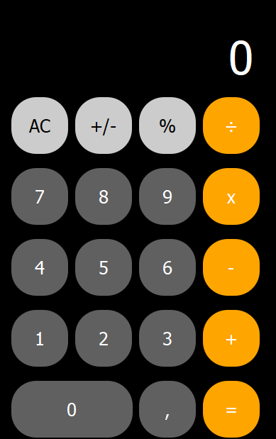

# Calculadora IPhone 


  
  
  


<div align="center">

<div>
> Projeto desenvolvido durante o periodo do curso Técnico de Desenvolvimento de Sistemas SENAC.

### Ajustes e melhorias

O projeto ainda está em desenvolvimento e as próximas atualizações serão voltadas nas seguintes tarefas:

- [x] Interface Grafica
- [x] Layout do Iphone
- [ ] Ajustar tamanho da fonte do display
- [ ] Implementa notação cientifica
- [ ] Prédefinir o tamanho fixo da interface


## 💻 Pré-requisitos

Antes de começar, verifique se você atendeu aos seguintes requisitos:

- Você instalou a versão mais recente de `<python 3.12>`

- Você tem uma máquina `<Windows / Linux >`. 

- Configurado o ambiente virtual:
  - 'python -m venv env'

- Você tem instalado as seguintes dependencias
  -'pyqt5 '
  -'auto-py-to-exe' 

## 🚀 Instalando <Calculadora IPhone>

Para instalar o <Calculadora IPhone>, siga estas etapas:

Windows:

```
python -m venv env
env\Scripts\Activate.ps1
python -m pip install pyqt5
python -m pip install auto-py-to-exe

```

## ☕ Usando <calculado Iphone>

Para usar <Calculadora IPhone>, siga estas etapas:

```
python main.py

```

## 📫 Contribuindo para <Calculadora IPhone>

Para contribuir com <Calculadora IPhone>, siga estas etapas:

1. Bifurque este repositório.
2. Crie um branch: `Calculadora-IPhone>`.
3. Faça suas alterações e confirme-as: `git commit -m '<mensagem_commit>'`
4. Envie para o branch original: `git push origin <nome_do_projeto> / <local>`
5. Crie a solicitação de pull.

Como alternativa, consulte a documentação do GitHub em [como criar uma solicitação pull](https://help.github.com/en/github/collaborating-with-issues-and-pull-requests/creating-a-pull-request).

<!-- ## 🤝 Colaboradores

Agradecemos às seguintes pessoas que contribuíram para este projeto:

<table>
  <tr>
    <td align="center">
      <a href="#" title="Otávio Henrique">
        <br>
        <sub>
          <b>Otavio Henrique</b>
        </sub>
      </a>
    </td>
  </tr>
</table> -->
